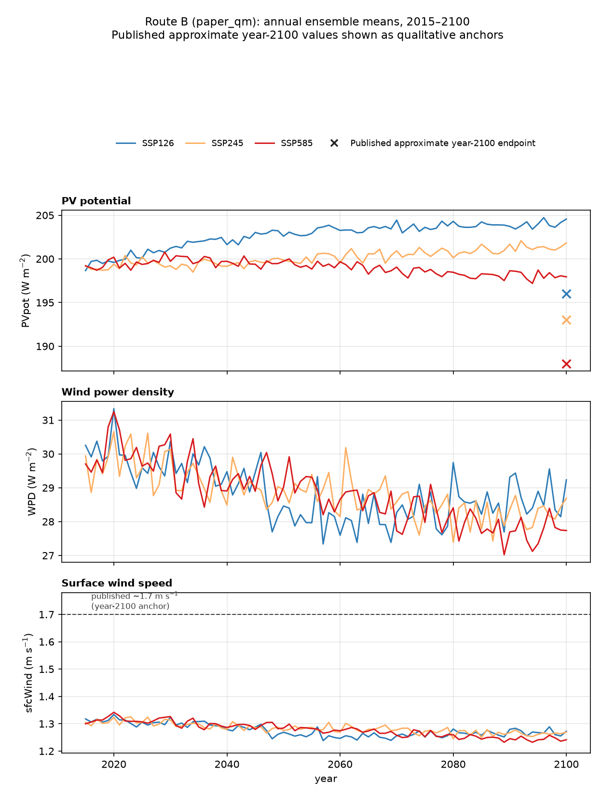
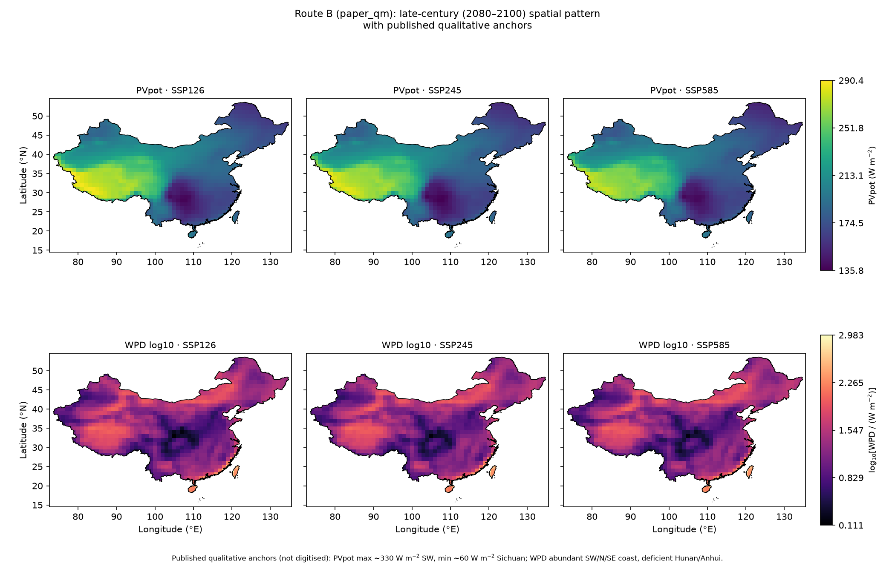
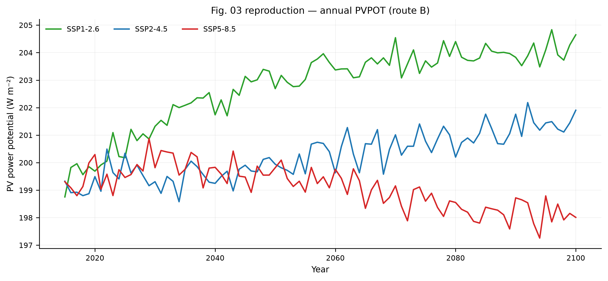
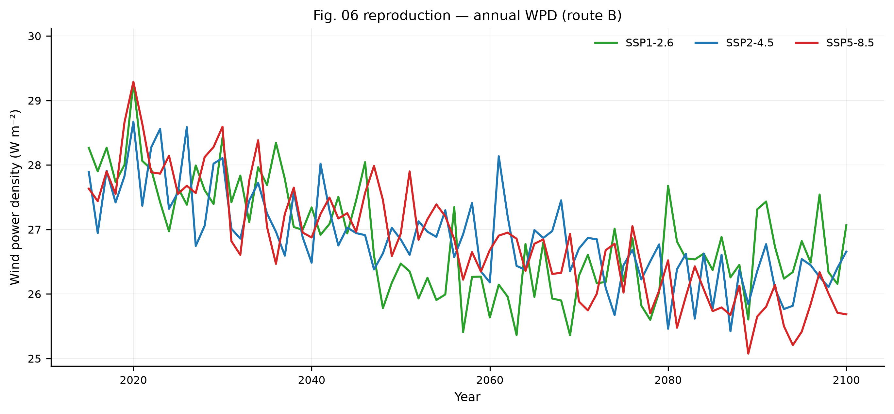
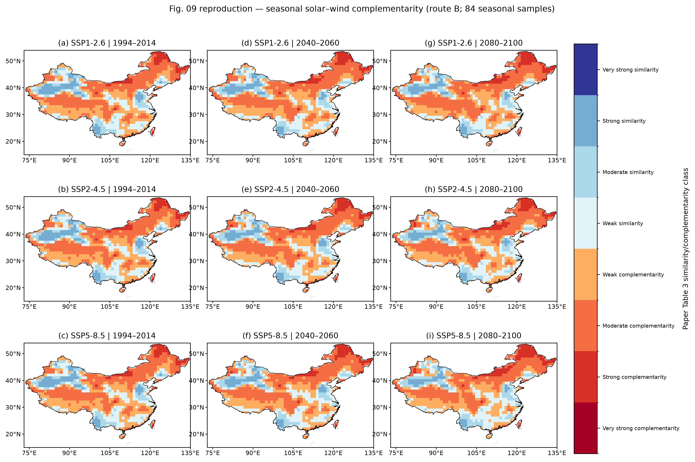
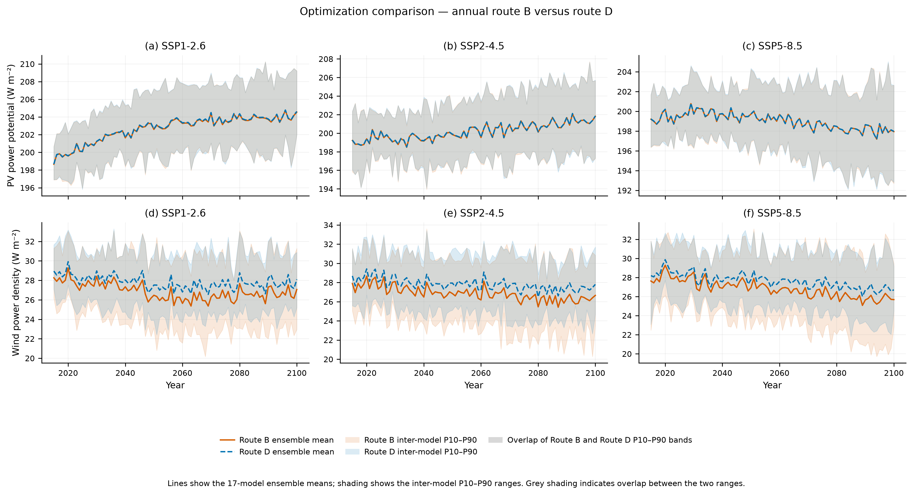

# China PV & Wind Power under CMIP6 Scenarios

A multimodel (17-model) assessment of photovoltaic (PV) and wind-energy
potential and their complementarity over China, with Quantile-Mapping / Quantile
-Delta-Mapping (QM/QDM) bias correction against ERA5 reanalysis. This repository
reproduces the study's baseline route and an optimized variant.

> The repository ships the **code, configuration, and small results** — not the
> multi-GB climate data. See [Data availability](#data-availability).

---

## 1. Purpose

- **Reproduce** the baseline (paper) route of the PV/wind study.
- **Optimize** the bias-correction chain with a QDM variant and evaluate the
  resulting change in PV potential, wind power density, and complementarity.
- Produce 23 core B/D figures (9 paper-baseline Route B, 9 optimized-route Route D, and 5 method-comparison B−D figures), plus 2 paper-reproduction comparison figures.

## 2. Data

- **Models:** 17 CMIP6 global climate models (ACCESS-CM2, ACCESS-ESM1-5,
  AWI-CM-1-1-MR, BCC-CSM2-MR, CAS-ESM2-0, CESM2-WACCM, CMCC-CM2-SR5,
  CMCC-ESM2, CanESM5, FGOALS-f3-L, FIO-ESM-2-0, IPSL-CM6A-LR, KACE-1-0-G,
  MPI-ESM1-2-HR, MPI-ESM1-2-LR, MRI-ESM2-0, TaiESM1).
- **Scenarios:** SSP1-2.6, SSP2-4.5, SSP5-8.5 (`ssp126`, `ssp245`, `ssp585`).
- **Variables:** near-surface air temperature `tas`, downwelling shortwave
  radiation `rsds`, 10 m wind speed `sfcWind`.
- **Reanalysis:** ERA5 (used as the bias-correction reference and for the
  validation window).
- **Domain:** China land area within the study domain (73–135°E, 15–54°N);
  areas south of 15°N are outside the quantitative domain. Natural Earth
  stores the relevant geometries as separate `CHN`/`TWN`/`HKG`/`MAC` records,
  which are unioned solely to construct the quantitative analysis boundary.
  This analysis boundary is a scientific mask and **is not an official
  standard map**.
- **Spatial weighting (method C):** every national spatial mean is weighted by
  the **geodesic intersection area** between each grid cell and the analysis
  boundary (WGS84 ellipsoid) — not by a centre-point mask or `cos(latitude)`.
  The boundary polygon's own geodesic area is reported as the
  **analysis-boundary polygon area**, which is *not* official China land area.

## 3. Periods

- **Bias-correction calibration (fit) period:** 1959–2014.
- **Historical analysis baseline:** 1994–2014.
- **Future:** 2015–2100, summarised as mid-century (2040–2060) and
  late-century (2080–2100).

## 4. Routes B and D

- **Route B (paper baseline):** the study's QM method — reproduces the paper
  figures `Fig02`–`Fig10`.
- **Route D (optimized):** the QDM variant — compared against B in
  `Opt01`–`Opt04`.
- **Two aggregation definitions:** grid-wise maps (definition 1) and national
  aggregates (definition 2).
- **Model-first, native-grid aggregation:** per-model diagnostics are computed
  on each model's native grid, then summarised there (annual national series)
  or bilinearly interpolated to the common 1° grid before an equal-weight
  17-model ensemble. No downscaling or gap-filling is applied.

## 5. Pipeline (8 stages)

1. **Download** — CMIP6 (CEDA) and ERA5 (CDS); `scripts/01_download/`.
2. **Prepare** — clip to China, regrid ERA5 onto each model grid, build
   reference periods; `scripts/02_data_preparation/`.
3. **Bias correction** — QM/QDM, quantiles Q02–Q98, 30-year window;
   `scripts/03_bias_correction/`.
4. **Energy metrics** — PV potential and wind power density (incl. hub-height
   sensitivity and complementarity); `scripts/04_energy_metrics/`.
5. **Figure data** — multimodel ensemble + final-analysis products;
   `scripts/05_figure_data/`.
6. **Plotting** — the 23 core figures; `scripts/06_plotting/`.
7. **Validation** — ERA5 2015–2025 holdout / validation;
   `scripts/07_validation/`.
8. **Paper reproduction comparison** — Route B against published quantitative
   and qualitative anchors; `scripts/08_reproduction_comparison/`.

## 6. Running the pipeline

All production scripts read their paths from `config/project_paths.json` via
`scripts/common/project_paths.py` (no absolute paths, no hard-coded locations).
Run from the repository root:

```bash
conda activate pvwind

# Stage 3 — bias correction (51 model x scenario combinations)
python scripts/03_bias_correction/qm_qdm_batch_production.py --dry-run
python scripts/03_bias_correction/qm_qdm_batch_production.py

# Stage 4 — energy metrics
python scripts/04_energy_metrics/compute_energy_metrics_batch.py --dry-run
python scripts/04_energy_metrics/compute_energy_metrics_batch.py

# Stage 5 — multimodel ensemble, then final-analysis products
python scripts/05_figure_data/build_multimodel_ensemble.py --dry-run
python scripts/05_figure_data/build_multimodel_ensemble.py
python scripts/05_figure_data/build_final_analysis_products.py --dry-run
python scripts/05_figure_data/build_final_analysis_products.py

# Stage 6 — plot the 23 core figures
python scripts/06_plotting/plot_final_figures.py --dry-run
python scripts/06_plotting/plot_final_figures.py

# Stage 8 — paper reproduction comparison (read-only; CSVs + Markdown + 2 figures)
python scripts/08_reproduction_comparison/compare_with_paper.py
```

Stage 1–2 require access to the CMIP6 (CEDA) and ERA5 (CDS) archives and are
run before Stage 3. Stage 7 (`era5_2015_2025_validation.py`,
`run_qm_qdm_holdout_pilot_3x3.py`) is an independent validation pass.

Useful options on the main scripts: `--models` / `--scenarios` (run a subset),
`--expected-model-count` / `--expected-models` (assert the model count),
`--hub-height`, `--lower`/`--upper` (quantile bounds), `--force` (recompute).

## 7. Dry-run mode

Every production script supports `--dry-run`, which validates every input path,
grid, calendar, unit, dimension, and column **without writing any output**:

```bash
python scripts/03_bias_correction/qm_qdm_batch_production.py --dry-run   # 51/51
python scripts/04_energy_metrics/compute_energy_metrics_batch.py --dry-run  # 51/51
python scripts/05_figure_data/build_multimodel_ensemble.py --dry-run
python scripts/05_figure_data/build_final_analysis_products.py --dry-run
python scripts/06_plotting/plot_final_figures.py --dry-run
```

Run a dry-run first to confirm the environment and inputs before any production
run.

## 8. Data availability

The raw and intermediate data are **not** distributed with this repository
(≈73 GiB total). They must be re-obtained from the sources and placed in the
directories declared in `config/project_paths.json`:

```
data/raw/          # CMIP6 downloads, ERA5 raw (.grib), ERA5 archives
data/interim/      # China-clipped CMIP6, ERA5 reference, ERA5-on-GCM-grid
data/processed/    # bias_correction/, energy_metrics/, validation/
data/boundaries/   # china_qc_boundary.shp
```

The small, regenerable **results** (figures, summary tables, final-analysis
products, audit summaries) are included — see
`docs/public_release_file_manifest.md` for the exact allow/deny list.

## 9. Main results

**23 core B/D analysis figures:** 9 paper-baseline Route B, 9 optimized Route D, and 5 method-comparison B/D figures.

- **Paper baseline (`results/figures/paper_baseline/`):** `Fig02`–`Fig10`
  (route B) — climate factors, PV potential (annual/period-maps/gridwise change),
  wind power density (annual/period-maps/gridwise change), and seasonal/monthly
  complementarity.
- **Optimized route (`results/figures/optimized_route/`):** `Fig02`–`Fig10`
  (route D) — the same nine layouts drawn from the optimized method, with
  colorbar/y-limits shared with the paper-baseline figures (joint B+D scales).
- **Method comparison (`results/figures/method_comparison/`):** `Opt01`–`Opt04` —
  annual energy B-vs-D, PV/WPD period relative difference (D−B), national change
  (definition 2), and late-century complementarity ρ (D−B).

Key summary tables live in `results/tables/` (cross-model `combined_*.csv`) and
the final-analysis products in `results/figure_data/final_analysis/`.

### Paper reproduction comparison (2 additional figures)

A read-only Route B (`paper_qm`) comparison against the study's published
quantitative and qualitative anchors — see
[`docs/paper_reproduction_comparison.md`](docs/paper_reproduction_comparison.md).
These two figures are **additional** and are **not** part of the 23 core figures.





### Selected results

Four representative figures from the core set of 23:



*Baseline Route B: annual mean photovoltaic power potential over China.*



*Baseline Route B: annual mean wind power density over China.*



*Baseline Route B: seasonal wind-solar complementarity over China.*



*Annual PV potential and wind power density under routes B and D. Lines show the equal-weight 17-model ensemble mean; shaded bands show the inter-model P10–P90 range.*

## 10. Current validation status

| Check | Result |
|---|---|
| Bias-corrected NetCDF | **153/153** present |
| Energy-metric NetCDF | **272/272** present |
| Core B/D figures | **23** (9 paper-B + 9 optimized-D + 5 comparison) |
| Paper-reproduction figures | **2** |
| Public PNG figures | **25** |
| Bias-correction audit | **PASS** (153/153, 51/51 manifests) |
| Energy-metrics audit | **PASS** (272/272, 0 failures) |
| Downstream dry-runs | **PASS** (all stages) |

The full audit report is a local-only document (not published; see
`docs/public_release_file_manifest.md`).

## 11. Known scientific warnings

The bias-correction audit reports **45 warnings** (all WARNING, none FAILURE),
pre-existing and unchanged:

- **42 × `tail_trigger_percent` on `tas`** — future values outside the
  historical Q02–Q98 calibration range (expected in a warming scenario).
- **3 × `physical_range` on `rsds`**.

These flag conditions for review but do not invalidate the archive.

## 12. cfgrib / ecCodes (GRIB only)

`cfgrib` is needed only to read the raw ERA5 `.grib` files; it additionally
requires the **ecCodes** C library. All NetCDF-based production is unaffected.
See `docs/environment_notes.md`.

## 13. Citation & data sources

If you use this software or its results, please cite it via the
[`CITATION.cff`](CITATION.cff) file (author: **X-X-5**), and also cite the
underlying study:

> Fan, Y., Zhong, P.-A., Zhu, F., Mo, R., Wang, H., Wei, J., Zeng, Y.,
> Wang, B., & Qian, X. (2025). Assessing the potential and complementary
> characteristics of China’s solar and wind energy under climate change.
> *Renewable Energy, 249*, 123213.
> https://doi.org/10.1016/j.renene.2025.123213

The manuscript PDF was consulted locally during development and is not
distributed with this repository.

Data providers:

- **CMIP6** model output — distributed through the Earth System Grid Federation
  (ESGF). 16 of the 17 models were obtained from the CEDA Archive
  (data.ceda.ac.uk); **CAS-ESM2-0** was obtained from the Oak Ridge National
  Laboratory (ORNL) ESGF/THREDDS node.
- **ERA5** reanalysis — Copernicus Climate Data Store (CDS) / ECMWF, regridded
  to each GCM's native grid for bias correction.

## 14. Limitations

- This is a **research pipeline and result archive**, not a packaged library.
- The exact figures depend on the specific model ensemble, calibration window,
  and aggregation choices; results should be interpreted as a multimodel
  assessment, **not** a strictly pixel-perfect reproduction of any single run.
- Raw data redistribution is out of scope (see §8).
- The quantitative boundary is a scientific mask (Natural Earth 10m, `CHN` +
  `TWN` + `HKG` + `MAC`), not an official standard map; figures intended for
  official publication should use the standard-map service with an approval
  number and the required South China Sea inset.
- National statistics use intersection-area weighting: a cell contributes to a
  national mean when its area intersects the analysis-boundary polygon, and its
  weight is that overlap area. Map figures draw every finite intersecting cell
  and are then clipped to the polygon outline; values are not downscaled,
  gap-filled, or neighbour-interpolated beyond the 1° ensemble grid.
- The legacy centre-point-mask / cos(latitude) ensemble route (a separate
  "first-ensemble" builder) has been removed from the active scripts and is no
  longer shipped as a project statistic; it remains recoverable from the git
  history.
- CanESM5's native grid is coarse, and its Stage-2 China clip keeps the minimal
  contiguous lat/lon index range enclosing every cell that *intersects* the
  analysis boundary. This retains the cell centred at 54.416°N whose southern
  half overlaps China's northernmost tip (northern Heilongjiang, ~53.02–53.57°N),
  so CanESM5 now covers the full analysis boundary. To supply that northern cell,
  the ERA5 reference is extended north to 56°N (still 70–140°E, 0.25°); the
  quantitative analysis boundary itself remains 15–54°N. All 17 models now cover
  ≥99.9999% of the boundary.

## 15. License

This project is released under the **MIT License** — see [`LICENSE`](LICENSE).

Copyright (c) 2026 **X-X-5**.
